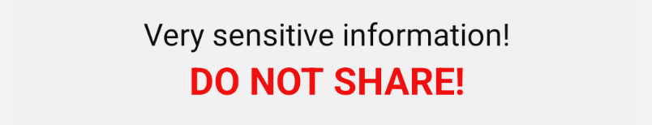
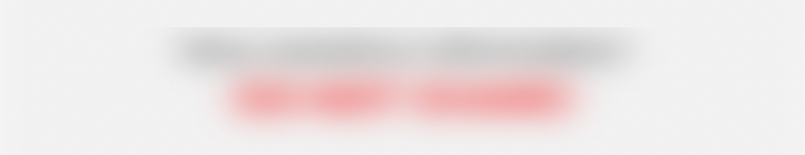
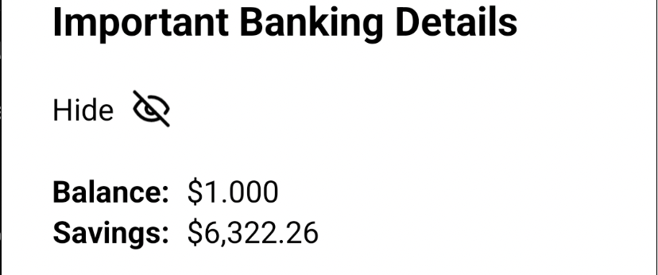
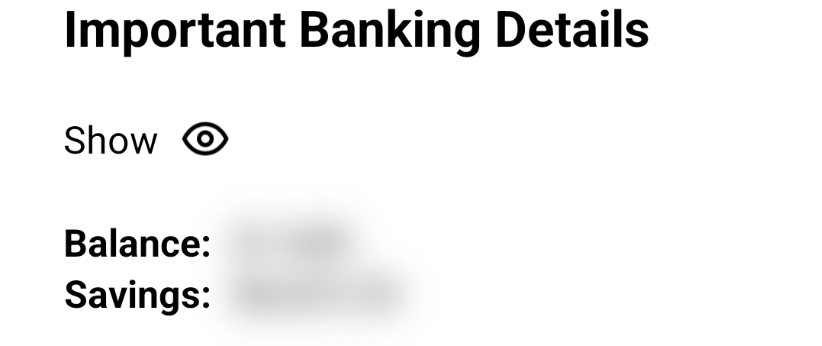
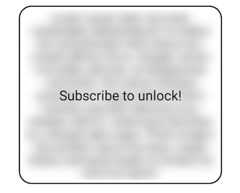

# Plugin.Maui.PrivacyGlass
[](https://www.nuget.org/packages/Plugin.Maui.PrivacyGlass) [](https://www.nuget.org/packages/Plugin.Maui.PrivacyGlass/#versions-body-tab) [](https://buymeacoffee.com/fabribertani)

`Plugin.Maui.PrivacyGlass` is a lightweight, cross-platform plugin for .NET MAUI that helps you hide sensitive information with a native blur overlay.

Whether you're building banking apps, authentication flows, or secure dashboards, `PrivacyGlass` gives you a simple way to blur UI elements until the user is authenticated or opts in.

## Platforms Supported
| Platform           |    Version    |
|--------------------|:-------------:|
| .NET MAUI Android  |   API 31+     |
| .NET MAUI iOS      |   iOS 15+     |
| Mac Catalyst       |   15.0+       |
| Windows            | 10.0.17763+   |

## Installation
`Plugin.Maui.PrivacyGlass` is available via NuGet. Get the latest package and install it in your solution:

    Install-Package Plugin.Maui.PrivacyGlass

Initialize the plugin in your `MauiProgram` class:

```csharp
using Plugin.Maui.PrivacyGlass;

public static MauiApp CreateMauiApp()
{
    var builder = MauiApp.CreateBuilder();

    builder
        .UseMauiApp<App>()
        .ConfigureFonts(fonts =>
        {
            fonts.AddFont("OpenSans-Regular.ttf", "OpenSansRegular");
            fonts.AddFont("OpenSans-Semibold.ttf", "OpenSansSemibold");
        })
        .UsePrivacyGlass();

    return builder.Build();
}
```

## Using Plugin.Maui.PrivacyGlass

### Including the XAML namespace

To use the plugin in XAML, add the following `xmlns` to your page or view:

```xml
xmlns:privacyglass="clr-namespace:Plugin.Maui.PrivacyGlass.Controls;assembly=Plugin.Maui.PrivacyGlass"
```

### Using the PrivacyGlassView

Wrap the content you want to protect inside a `PrivacyGlassView`:

```xml
<privacyglass:PrivacyGlassView>
    <VerticalStackLayout>
        <Label
            HorizontalOptions="Center"
            HorizontalTextAlignment="Center"
            LineBreakMode="WordWrap"
            FontSize="Medium"
            TextColor="Black"
            Text="Very sensitive information!" />
        <Label
            HorizontalOptions="Center"
            HorizontalTextAlignment="Center"
            LineBreakMode="WordWrap"
            FontSize="Large"
            FontAttributes="Bold"
            TextColor="Red"
            Text="DO NOT SHARE!" />
    </VerticalStackLayout>
</privacyglass:PrivacyGlassView>
```
> **Note**: `PrivacyGlassView` protection is **not** enabled by default.

You can use the `IsProtected` property to toggle protection on or off:

| Unprotected content | Content protected |
|---------------------|:-----------------:|
| `<privacyglass:PrivacyGlassView IsProtected="False">`| `<privacyglass:PrivacyGlassView IsProtected="True"> `|
|  |  |

---
If you have multiple instances of the `PrivacyGlassView` on your page and want to toggle all at once, you can inject the `IPrivacyGlass` interface into your view and call the `TogglePrivacyGlass` method to toggle protection on or off.

```csharp
private readonly IPrivacyGlass _privacyGlass;

public MainPage(IPrivacyGlass privacyGlass)
{
    InitializeComponent();

    _privacyGlass = privacyGlass;
}

private void ShowHideAll_Clicked(object? sender, EventArgs e)
{
    MainThread.BeginInvokeOnMainThread(() =>
    {
        _privacyGlass.TogglePrivacyGlass();
    });
}
```
| Multiple unprotected content | Multiple content protected |
|-------------------|:------------------:|
|  |  |

---
Imagine you want to protect something behind a paywall or keep content secret until a user action. You can also add `KeepScreenOn="True"` to the `PrivacyGlassView` to prevent it from being affected by calls to the `TogglePrivacyGlass` method from `IPrivacyGlass`:

```xml
<Border
    StrokeThickness="2"
    Stroke="Black"
    StrokeShape="RoundRectangle 20"
    Padding="5">
    <Grid>
        <privacyglass:PrivacyGlassView
            IsProtected="True"
            KeepScreenOn="True">
            <!-- Super secret content here... -->
        </privacyglass:PrivacyGlassView>
        <Label
            VerticalOptions="Center"
            HorizontalOptions="Center"
            FontSize="Large"
            Text="Subscribe to unlock!" />
    </Grid>
</Border>
```


## Sample
Take a look at the [PrivacyGlassSample](https://github.com/FabriBertani/Plugin.Maui.PrivacyGlass/tree/main/samples/PrivacyGlassSample) for a detailed implementation of this plugin.

## Contributions
Feel free to open an [Issue](https://github.com/FabriBertani/Plugin.Maui.PrivacyGlass/issues) if you find any bugs or want to submit a PR.

## License
Plugin.Maui.PrivacyGlass is licensed under the [MIT](https://github.com/FabriBertani/Plugin.Maui.PrivacyGlass/blob/main/LICENSE) license.